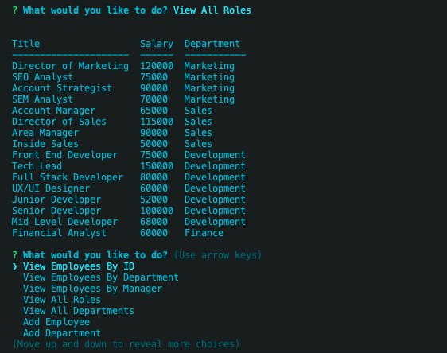

# Alliance Employee Management System
   

Alliance is a Content Management System designed to make it easy to view, add, and revise data within a company's employee hierarchy.  This is a command line application that runs with the help of Node.js, Inquirer, and MySQL.

## User Story
As a business owner <br>
I want to be able to view and manage the departments, roles, and employees in my company <br>
So that I can organize and plan my business


## Table of Contents
* [Installation](#installation)
* [Usage](#usage)
* [Screenshots](#screenshots)
* [Resources](#resources)
* [Contributions](#contributions)
* [Testing](#testing)
* [Questions](#questions)
* [License](#license)


## Installation
1. Clone the repo
2. Install required dependencies by running command ```npm i```
3. Use ```schema.sql``` file to insert tables into MySQL
4. Insert data specific to your company by creating a ```.csv file``` and importing into MySQL, or via a ```seeds.sql``` file
5. Run command ```node alliance``` to get started

## Usage
Follow the inquirer prompts to view, add, and edit your data

## Screenshots





## Resources
**Node.js** <br>
**MySQL** <br>
**Inquirer** <br>
**Figlet** <br>
**Console Table** <br>
**Chalk**

## Contributions
All contributions to this project are welcome!  Clone down the repo to your local machine, commit changes, push to GitHub, and open a pull request!

## Testing
No tests are set up for Alliance at this time.  Feel free to write tests or search the application for bugs.

## Questions
If you have any further questions, feel free to reach out to me! <br>
<a href='https://www.github.com/twkirkpatrick'>Github</a> <br>
<a href='mailto:twk4491@gmail.com'>twk4491@gmail.com</a>

## License
Usage is provided under the MIT license.